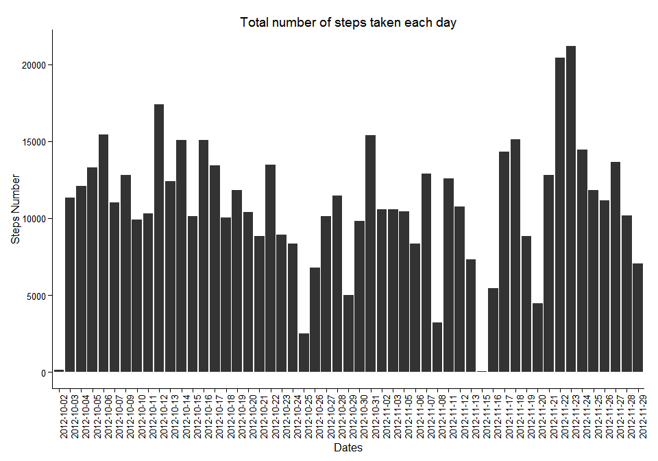
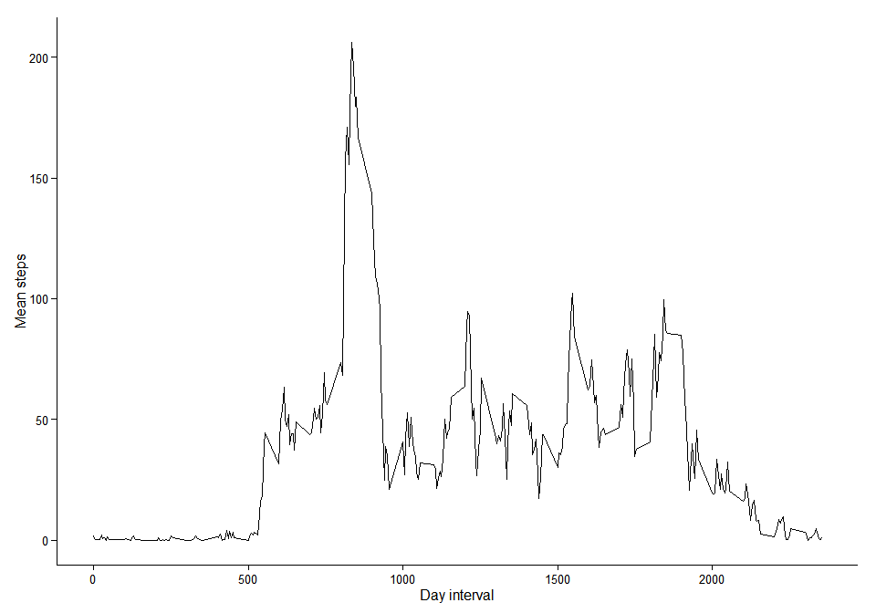
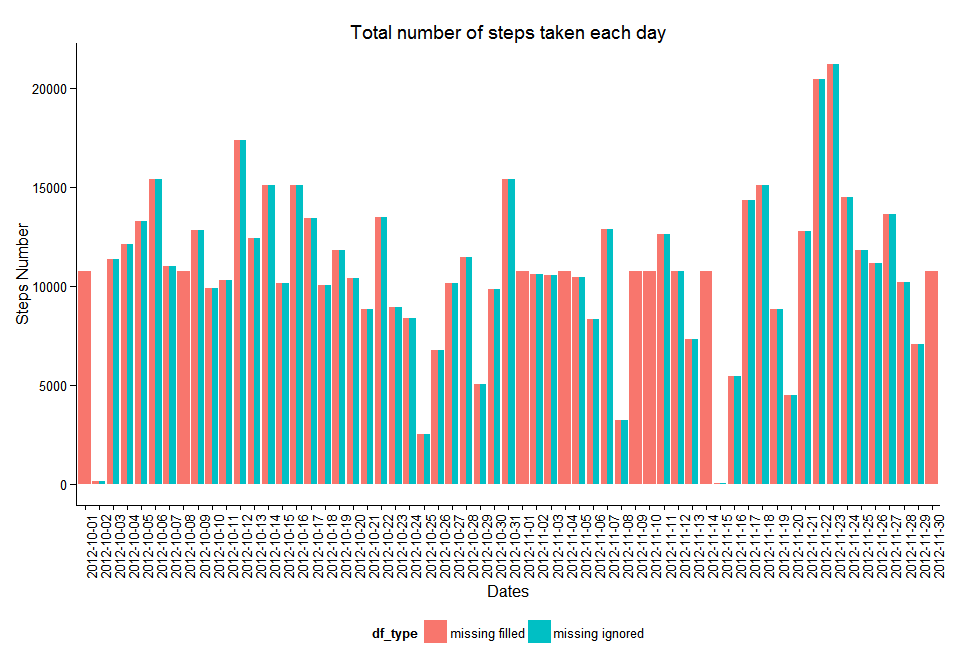
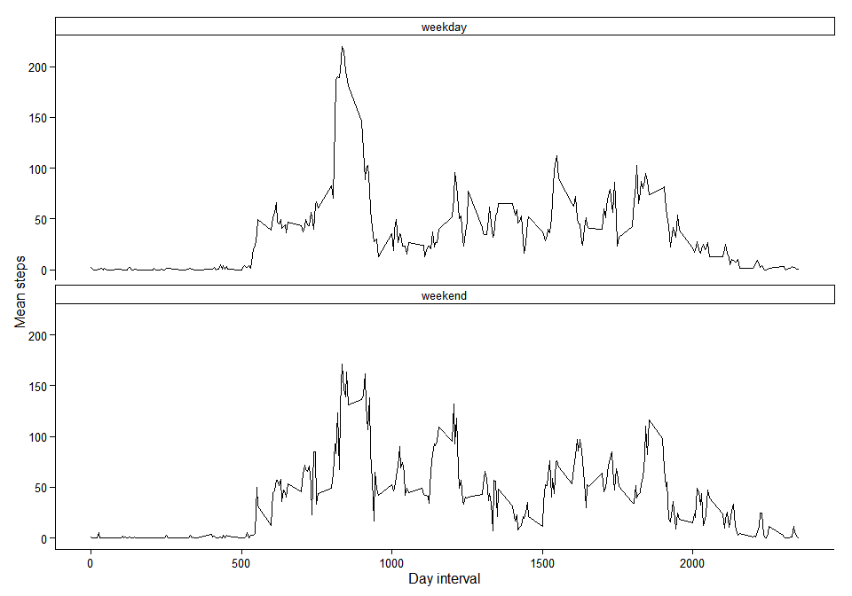

# Reproducible Research: Peer Assessment 1


## Loading and preprocessing the data


```r
data <- read.csv(unz("activity.zip", "activity.csv"))

#remove NA values from steps 
dataWOna <- subset(data, !is.na(data$steps))
```


## What is mean total number of steps taken per day?

####Histogram of the total number of steps taken each day

```r
library(ggplot2)

m <- ggplot(dataWOna, aes(x=date))
m <- m + geom_histogram(aes(weight = steps))
m <- m + theme_classic()
m <- m + theme(axis.text.x = element_text(angle = 90, hjust = 1))
m <- m + labs(
       x = "Dates",
       y = "Steps Number",
       title = "Total number of steps taken each day")
m
```

 

####Mean and median total number of steps taken per day

```r
library(plyr)
mean_median_steps <- ddply(dataWOna, .(date), summarise,
               mean = mean(steps),
               median = median(steps)
               )

print(mean_median_steps, row.names = FALSE)
```

```
##        date       mean median
##  2012-10-02  0.4375000      0
##  2012-10-03 39.4166667      0
##  2012-10-04 42.0694444      0
##  2012-10-05 46.1597222      0
##  2012-10-06 53.5416667      0
##  2012-10-07 38.2465278      0
##  2012-10-09 44.4826389      0
##  2012-10-10 34.3750000      0
##  2012-10-11 35.7777778      0
##  2012-10-12 60.3541667      0
##  2012-10-13 43.1458333      0
##  2012-10-14 52.4236111      0
##  2012-10-15 35.2048611      0
##  2012-10-16 52.3750000      0
##  2012-10-17 46.7083333      0
##  2012-10-18 34.9166667      0
##  2012-10-19 41.0729167      0
##  2012-10-20 36.0937500      0
##  2012-10-21 30.6284722      0
##  2012-10-22 46.7361111      0
##  2012-10-23 30.9652778      0
##  2012-10-24 29.0104167      0
##  2012-10-25  8.6527778      0
##  2012-10-26 23.5347222      0
##  2012-10-27 35.1354167      0
##  2012-10-28 39.7847222      0
##  2012-10-29 17.4236111      0
##  2012-10-30 34.0937500      0
##  2012-10-31 53.5208333      0
##  2012-11-02 36.8055556      0
##  2012-11-03 36.7048611      0
##  2012-11-05 36.2465278      0
##  2012-11-06 28.9375000      0
##  2012-11-07 44.7326389      0
##  2012-11-08 11.1770833      0
##  2012-11-11 43.7777778      0
##  2012-11-12 37.3784722      0
##  2012-11-13 25.4722222      0
##  2012-11-15  0.1423611      0
##  2012-11-16 18.8923611      0
##  2012-11-17 49.7881944      0
##  2012-11-18 52.4652778      0
##  2012-11-19 30.6979167      0
##  2012-11-20 15.5277778      0
##  2012-11-21 44.3993056      0
##  2012-11-22 70.9270833      0
##  2012-11-23 73.5902778      0
##  2012-11-24 50.2708333      0
##  2012-11-25 41.0902778      0
##  2012-11-26 38.7569444      0
##  2012-11-27 47.3819444      0
##  2012-11-28 35.3576389      0
##  2012-11-29 24.4687500      0
```


## What is the average daily activity pattern?

```r
mean_interval_steps <- ddply(dataWOna, .(interval), summarise,
               mean_steps = mean(steps)
               )
max_mean_interval <- with(mean_interval_steps, interval[mean_steps == max(mean_steps)])

l <- ggplot(mean_interval_steps, 
       aes(interval, mean_steps))
l <- l + geom_line() 
l <- l + theme_classic()
l <- l + xlab("Day interval") 
l <- l + ylab("Mean steps")
l
```

 

835 interval  on average across all the days in the dataset, contains the maximum number of steps


## Imputing missing values

```r
na_rows <- nrow(data[is.na(data$steps),])


df_mean <- merge(x = data, y = mean_interval_steps, by = "interval", all = TRUE)

#set steps to interval mean 
df_mean[is.na(df_mean$steps),]$steps <- df_mean[is.na(df_mean$steps),]$mean_steps 
df_mean$mean_steps <- NULL


#and combine dataset with mean and w/o mean
dataWOna$df_type <- "missing ignored"
df_mean$df_type <- "missing filled"

combinedData <- rbind(dataWOna, df_mean)

c <- ggplot(combinedData, aes(x=date, fill = df_type))
c <- c + geom_histogram(aes(weight = steps), position="dodge")
c <- c + theme_classic()
c <- c + theme(axis.text.x = element_text(angle = 90, hjust = 1))
c <- c + labs(
       x = "Dates",
       y = "Steps Number",
       title = "Total number of steps taken each day")
c <- c + theme(legend.position="bottom")
c
```

 


#### The is no impact of imputing missing data except the dates that all the data was missing


## Are there differences in activity patterns between weekdays and weekends?


```r
mean_median_steps_combined <- merge (mean_median_steps,
                ddply(df_mean, .(date), summarise, mean_wo_missing = mean(steps), median_wo_missing = median(steps)), 
                by="date", all = TRUE)

print(mean_median_steps_combined, row.names = FALSE)
```

```
##        date       mean median mean_wo_missing median_wo_missing
##  2012-10-01         NA     NA      37.3825996          34.11321
##  2012-10-02  0.4375000      0       0.4375000           0.00000
##  2012-10-03 39.4166667      0      39.4166667           0.00000
##  2012-10-04 42.0694444      0      42.0694444           0.00000
##  2012-10-05 46.1597222      0      46.1597222           0.00000
##  2012-10-06 53.5416667      0      53.5416667           0.00000
##  2012-10-07 38.2465278      0      38.2465278           0.00000
##  2012-10-08         NA     NA      37.3825996          34.11321
##  2012-10-09 44.4826389      0      44.4826389           0.00000
##  2012-10-10 34.3750000      0      34.3750000           0.00000
##  2012-10-11 35.7777778      0      35.7777778           0.00000
##  2012-10-12 60.3541667      0      60.3541667           0.00000
##  2012-10-13 43.1458333      0      43.1458333           0.00000
##  2012-10-14 52.4236111      0      52.4236111           0.00000
##  2012-10-15 35.2048611      0      35.2048611           0.00000
##  2012-10-16 52.3750000      0      52.3750000           0.00000
##  2012-10-17 46.7083333      0      46.7083333           0.00000
##  2012-10-18 34.9166667      0      34.9166667           0.00000
##  2012-10-19 41.0729167      0      41.0729167           0.00000
##  2012-10-20 36.0937500      0      36.0937500           0.00000
##  2012-10-21 30.6284722      0      30.6284722           0.00000
##  2012-10-22 46.7361111      0      46.7361111           0.00000
##  2012-10-23 30.9652778      0      30.9652778           0.00000
##  2012-10-24 29.0104167      0      29.0104167           0.00000
##  2012-10-25  8.6527778      0       8.6527778           0.00000
##  2012-10-26 23.5347222      0      23.5347222           0.00000
##  2012-10-27 35.1354167      0      35.1354167           0.00000
##  2012-10-28 39.7847222      0      39.7847222           0.00000
##  2012-10-29 17.4236111      0      17.4236111           0.00000
##  2012-10-30 34.0937500      0      34.0937500           0.00000
##  2012-10-31 53.5208333      0      53.5208333           0.00000
##  2012-11-01         NA     NA      37.3825996          34.11321
##  2012-11-02 36.8055556      0      36.8055556           0.00000
##  2012-11-03 36.7048611      0      36.7048611           0.00000
##  2012-11-04         NA     NA      37.3825996          34.11321
##  2012-11-05 36.2465278      0      36.2465278           0.00000
##  2012-11-06 28.9375000      0      28.9375000           0.00000
##  2012-11-07 44.7326389      0      44.7326389           0.00000
##  2012-11-08 11.1770833      0      11.1770833           0.00000
##  2012-11-09         NA     NA      37.3825996          34.11321
##  2012-11-10         NA     NA      37.3825996          34.11321
##  2012-11-11 43.7777778      0      43.7777778           0.00000
##  2012-11-12 37.3784722      0      37.3784722           0.00000
##  2012-11-13 25.4722222      0      25.4722222           0.00000
##  2012-11-14         NA     NA      37.3825996          34.11321
##  2012-11-15  0.1423611      0       0.1423611           0.00000
##  2012-11-16 18.8923611      0      18.8923611           0.00000
##  2012-11-17 49.7881944      0      49.7881944           0.00000
##  2012-11-18 52.4652778      0      52.4652778           0.00000
##  2012-11-19 30.6979167      0      30.6979167           0.00000
##  2012-11-20 15.5277778      0      15.5277778           0.00000
##  2012-11-21 44.3993056      0      44.3993056           0.00000
##  2012-11-22 70.9270833      0      70.9270833           0.00000
##  2012-11-23 73.5902778      0      73.5902778           0.00000
##  2012-11-24 50.2708333      0      50.2708333           0.00000
##  2012-11-25 41.0902778      0      41.0902778           0.00000
##  2012-11-26 38.7569444      0      38.7569444           0.00000
##  2012-11-27 47.3819444      0      47.3819444           0.00000
##  2012-11-28 35.3576389      0      35.3576389           0.00000
##  2012-11-29 24.4687500      0      24.4687500           0.00000
##  2012-11-30         NA     NA      37.3825996          34.11321
```


```r
library(timeDate)

df_mean$isWeekDay <- factor(isWeekday(as.POSIXct(df_mean$date, format="%Y-%m-%d"), wday = 1:5), levels=c(TRUE, FALSE), labels=c("weekday", "weekend"))


df_mean_interval_steps <- ddply(df_mean, .(interval, isWeekDay), summarise,
               mean_steps = mean(steps)
               )

l <- ggplot(df_mean_interval_steps, 
       aes(interval, mean_steps))
l <- l + geom_line() 
l <- l + theme_classic()
l <- l + xlab("Day interval") 
l <- l + ylab("Mean steps")
l <- l + facet_wrap(~isWeekDay, nrow = 2)
l
```

 

